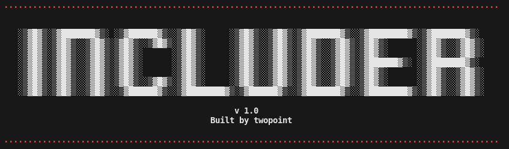

# Includer
Automatically enumerate RCE methods, key system files, and webroot files within LFI vulnerabilities.

## Usage

```
usage: includer.py [-h] [-c] [-r] [-k] url parameter

positional arguments:
  url             Full URL of LFI-vulnerable page. Example: http://www.example.com/page.php?foo=bar&vulnerable=LFI
  parameter       Parameter to be used for LFI fuzzing.

options:
  -h, --help      show this help message and exit
  -c, --crawl     Only webcrawl.
  -r, --rce       Only test for RCE.
  -k, --keyfiles  Only search for keyfiles.
```
## Project Overview
Includer was made to be a one-button solution to LFI crawling. I got tired of using fuzzers with random wordlists and having to check PHP wrappers for RCE. Includer isn't very complicated, but it is painless to use and looks nice.


## Future Work
- Interactive shell for RCE methods
- LFI method detection
- RFI detection
- Custom wordlist read-in
